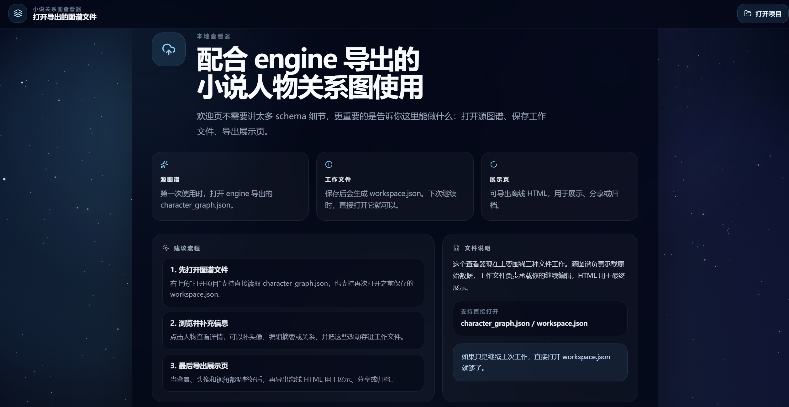
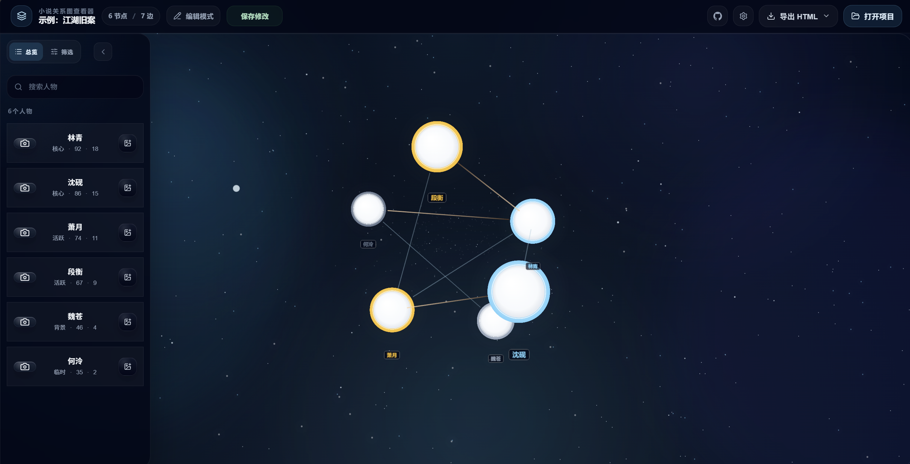

# Novel Graph Viz

✨ 面向小说人物关系图谱的本地查看器与整理前端。

它不是独立的数据生产端，而是 [`graph-every-novel`](https://github.com/Renakoni/graph-every-novel) 的配套 Viewer，用来打开引擎导出的 `character_graph.json`，查看人物关系图谱、补充头像、整理工作区，并导出可分享的离线展示页。

[在线体验（Vercel）](https://novel-graph-viz.vercel.app/) · [GitHub Pages 镜像](https://renakoni.github.io/novel-graph-viz/) · [源头引擎仓库](https://github.com/Renakoni/graph-every-novel) · [当前仓库](https://github.com/Renakoni/novel-graph-viz)

---

## 🎬 成果预览

### 欢迎页



### 2.5D 主界面



---

## 🧭 它在整条链路里的位置

整条链路分成两部分：

1. [`graph-every-novel`](https://github.com/Renakoni/graph-every-novel)
   - 导入小说文本
   - 逐章分析
   - 累计人物与关系状态
   - 导出 `character_graph.json`

2. `novel-graph-viz`
   - 打开 `character_graph.json`
   - 以图谱方式浏览人物与关系
   - 补充头像、整理工作区
   - 导出单文件 HTML 展示页

如果你是第一次接触这套项目，建议先看引擎仓库：

- <https://github.com/Renakoni/graph-every-novel>

---

## 🧩 它能做什么

- 打开 `character_graph.json` 查看人物关系图谱
- 查看人物详情、关系详情和摘要信息
- 上传人物头像并覆盖到图上的圆形节点
- 保存工作区，方便下次继续整理
- 导出单个离线 HTML，用于展示、分享或归档

---

## 🚀 三步开始使用

### 1. 先准备源图谱

先用引擎仓库导出：

```text
<workspace>/export/character_graph.json
```

引擎仓库入口：

- <https://github.com/Renakoni/graph-every-novel>

### 2. 在 Viewer 中打开

点击顶部“打开项目”，选择：

```text
character_graph.json
```

### 3. 整理并导出

你可以继续做这些事：

- 查看人物详情和关系详情
- 上传人物头像
- 切换背景和语言
- 开启编辑模式，修正人物与关系
- 保存为 `workspace.json`
- 导出为单个 `HTML`

---

## 🧭 操作方式

2.5D 视图默认交互如下：

- 左键拖动：旋转视角
- 滚轮滚动：缩放
- 按住中键拖动：平移
- 点击人物：打开人物详情
- 点击关系线：打开关系详情

---

## 📁 三种文件

### `character_graph.json`

源图谱文件，由 [`graph-every-novel`](https://github.com/Renakoni/graph-every-novel) 导出。

- 第一次使用时打开它
- 它是 Viewer 的主输入
- Viewer 不会直接改写它

### `workspace.json`

工作文件，用来继续上一次的整理结果。

- 保存当前工作区状态
- 包含图谱快照、头像、背景、语言和人工编辑结果
- 下次继续时，直接打开它即可

### `standalone.html`

展示文件，用来发给别人看。

- 单个 HTML 文件
- 可离线打开
- 适合展示、分享或归档

---

## 🔗 输入说明

当前主输入是：

```text
<workspace>/export/character_graph.json
```

Viewer 主路径读取的是轻量人物图谱数据：

- `project`
- `nodes`
- `pair_edges`
- `directed_edges`

如果输入结构有问题，优先回到引擎仓库核对导出契约：

- <https://github.com/Renakoni/graph-every-novel>

---

## 💻 本地开发

常用命令：

```bash
npm install
npm run dev
npm run build
```

---

## 🛠️ 继续开发时先看

- `src/pages/GraphPage.tsx`
- `src/components/graph/ForceGraph3DCanvas.tsx`
- `src/components/layout/TopBar.tsx`
- `src/data/loadProjectGraph.ts`
- `src/data/htmlExport.ts`
- `src/data/workspaceState.ts`
- `HANDOFF.md`

---

## 📦 命令行导出

除了界面内导出，也可以用命令行直接生成单文件 HTML：

```bash
npm run export:html -- --project path\to\character_graph.json
```

---

## 🔗 相关链接

- 在线体验：<https://novel-graph-viz.vercel.app/>
- GitHub Pages：<https://renakoni.github.io/novel-graph-viz/>
- 当前仓库：<https://github.com/Renakoni/novel-graph-viz>
- 源头引擎：<https://github.com/Renakoni/graph-every-novel>

---

## 🙏 致谢

这个项目的实现和视觉探索，参考了很多优秀的开源项目、图可视化工具和论文思路。这里列当前版本最直接相关的几项：

- [Three.js](https://threejs.org/)：底层图形渲染与 2.5D 场景能力
- [react-force-graph](https://github.com/vasturiano/react-force-graph) 与 [3d-force-graph](https://github.com/vasturiano/3d-force-graph)：图谱交互与力导视图生态
- [Motion / Framer Motion](https://motion.dev/docs)：界面过渡和交互动效
- [tsParticles](https://github.com/tsparticles)：背景粒子与氛围效果
- [ForceAtlas2, a Continuous Graph Layout Algorithm for Handy Network Visualization Designed for the Gephi Software](https://journals.plos.org/plosone/article?id=10.1371/journal.pone.0098679)

---

## 📄 License

This project is licensed under the [MIT License](LICENSE).
